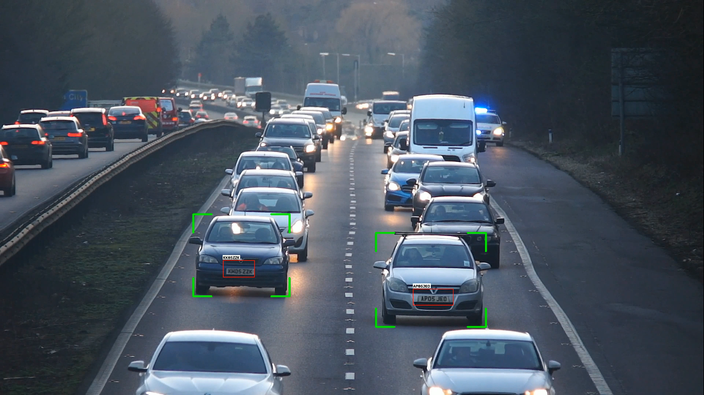

# Automatic Number Plate Recognition

This project implements automatic vehicle license plate detection using YOLOv8n trainied on custom dataset. It uses Bytracker with the help of YOLO model to track the the recogized vehicles. 
This project uses 2 YOLO models, one is for vehicle detection another one is for license plate detection. 

# Data 
The license plate detector was trained with Yolov8 using [this dataset](https://universe.roboflow.com/roboflow-universe-projects/license-plate-recognition-rxg4e/dataset/4).

# Output 

