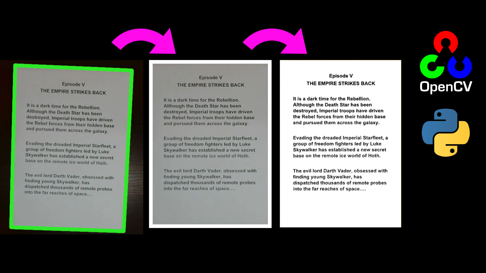

# Document Scanner
**A simple OpenCV project on image processing to convert Scanned looking document**

## What This Project Does
-   Convert image into gray scale image
-   applies gaussian blur
-   applies Otsu Threshold
-   Find counters and select biggest counter
-   applies Perspective transformation
-   convert scanned looking document using adaptive Threshold

