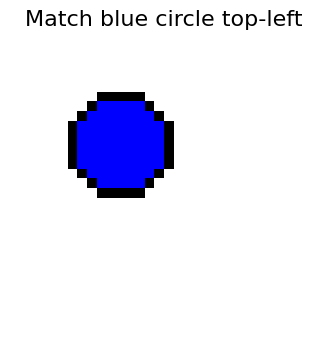
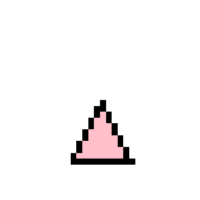

# Vision Language Model(VLM) From Scratch
---
In this project we trained a NanoVLM from scratch on Geometry shapes dataset. This dataset contains 243 unique images and their corresponding labels.
This VLM contains 2 encoders one is ImageEncoder and another one is TextEncoder. And we are using CLIP Loss and Adam optimzer for 50 epochs. 
---
Total number of paramerts:-
  ImageEncoder = 404,992 parameter
  TextEncoder = 22,592  parameter 
  Total = 427,584 = 0.428 Million parameters
---
### Output

For a given Text "blue circle top-left", The model predicted:-

For below Image the model predicted "grey triangle bottom".

